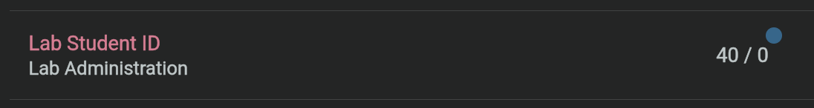

<style>
  .tab-container {
    display: flex;
    flex-wrap: wrap;
    font-family: -apple-system, BlinkMacSystemFont, "Segoe UI", Roboto, Helvetica, Arial, sans-serif;
    /* Light grey background for the whole tab strip */
    background: #f6f8fa; 
    padding-top: 5px; /* Space for the top pop-up effect */
  }
  
  .tab-container input[type="radio"] { display: none; }
  
  /* LABEL STYLING */
  .tab-container label {
    padding: 12px 24px;
    cursor: pointer;
    font-size: 14px;
    font-weight: 600;
    color: #57606a;
    background: transparent;
    /* Transparent top border by default */
    border-top: 3px solid transparent; 
    order: 1;
    margin-right: 2px;
    transition: all 0.2s ease;
  }
  
  .tab-container label:hover {
    color: #24292f;
    background: rgba(255,255,255,0.3);
  }

  /* CONTENT STYLING */
  .tab-container .tab-content {
    display: none;
    width: 100%;
    order: 2;
    padding-left: 15px;
    padding-right: 15px;
    background: #fff; /* Content is white */
    /* A subtle shadow to separate content from the grey tab bar */
    box-shadow: 0 5px 10px rgba(0,0,0,0.05); 
  }

  /* ACTIVE STATE */
  .tab-container input[type="radio"]:checked + label {
    background: #fff; /* Active tab becomes white */
    color: #24292f;
    /* THE TOP BAR COLOR (Red/Orange in this example) */
    border-top: 3px solid #2980B9; 
  }
  
  .tab-container input[type="radio"]:checked + label + .tab-content {
    display: block;
  }
</style>

# LAB 1: VM Setup and ROS Pub/Sub

This guide covers the configuration of the the Ubuntu VM. Then by using the official ROS 2 Jazzy documentation, you learn how to navigate the primary resource for ROS 2.

#### What You’ll Learn:
- VM Management: How to import, configure, and optimize your virtual workspace using VMware.
- Linux Essentials: Navigating the Ubuntu file system and mastering the Bash command line.
- ROS2 Basics: Creating a workspace, compiling code, and implementing the Publisher/Subscriber pattern to communicate between nodes.

#### Evaluation
Your grade will be based on a live demonstration and a technical interview covering:
- Live Demo: Show your Publisher and Subscriber nodes communicating successfully.
- Oral Examination: Explain how the Publisher/Subscriber pattern works and how you configured your nodes.
- Live Modification: Demonstrate code proficiency by making small, real-time changes to your logic.

## PART 1: VM Setup
Install VMWare Workstation (Windows/Linux) or VMWare Fusion 25H2 (MacOS) from [here](https://knowledge.broadcom.com/external/article/368667/download-and-license-vmware-desktop-hype.html). The Host computer will run an Ubuntu 24.04 VM using VMWare. ROS 2 Jazzy FastDDS (along with a lot of useful tools) is installed in the Ubuntu VM.

> Note: The download process is a bit annoying. You will need to create an account first (Click on Login -> Register). After logging in, click on "My Downloads", search for the right software, Check on "Terms and Conditions", and then finally download it. 


### 1. Importing the VM
1.  Open VMware (Workstation, Player, or Fusion).
2.  Select **File > Open** and choose the provided `.ova` file.
3.  If VMware asks if *"This virtual machine might have been moved or copied.", Select "_I copied it_"

### 2. Optimizing Hardware Settings
Before clicking "Power On," select **Edit Virtual Machine Settings** and apply these optimizations:

| Setting | Recommended Value | Reason |
| :--- | :--- | :--- |
| **Memory (RAM)** | **8 - 16 GB** | Essential for Ubuntu 24.04 and Gazebo performance. |
| **Processors** | **4 to 8 Cores** | ROS 2 handles many nodes in parallel. |
| **Graphics** | **Accelerate 3D Graphics (ON)** | Critical for Rviz and Gazebo visualization. |
| **Graphics Memory**| **1GB** | Prevents GUI flickering in simulations. |
| **Network Adapter**| **Bridged (Automatic)** | VM needs its own IP for ROS setup. |

> **NOTE:** If you need to lower these values slightly due to hardware limitations, the VM should still function. If your computer was purchased within the last 4 years, it will likely run the VM without issues.

---

### 3: Get your Unique Student ID
1. Go to [Canvas](https://canvas.asu.edu/courses/249083/) and click on **Grades**.
2. You should see a score for the Assignment **Lab Student ID**. The score is your **Lab Student ID**.

For example, in the below screenshot of the Grades Page, the **Lab Student ID** is **40** (Ignore the "/0").


### 4: First Boot

```note
In Ubuntu 24.04 VM, 
  username: `eva` and
  password: `wall-E`. 

Password for keyring: `wall-e`. This is **ONLY** when the keyring password is requested in a GUI window. For example, when you start VS Code after a reboot.
```

Note> Make sure you change the display settings to match the resolution and scaling required for your monitor.

1. Open a terminal using the Tilix application on the Ubuntu global menu. 
> Tilix is a tiling terminal emulator for Linux that allows you to organize multiple terminal sessions into a single window using a flexible grid layout.
1. Run the commands below:
```bash
cd ~/vm_setup
git pull
./first_boot.sh
```
> Note: Enter your unique Lab Student ID when requested by the script.

In the above bash commands, you are pulling the latest changes from the git repo [vm_setup](https://github.com/ras-mobile-robotics/vm_setup) hosted on GitHub (If you are unfamiliar with git, dont worry! We will post a quick guide for git soon.). 

You then run the script **first_boot.sh**. It will automatically set your VM to a unique hostname (different from the ubuntu VMs run by other students) to `ubuntuvm{LAB_STUDENT_ID}`. It will subsequently ask you to reboot the VM for the changes to take place.

---

### 5: Get IP

After reboot, your VM should be connected to the same WiFi as your host computer.
Run the below command in a terminal in the VM to get the IP address of your VM:

```bash
ip -4 addr show | grep -oP '(?<=inet\s)\d+(\.\d+){3}' | grep -v '127.0.0.1' | head -n 1
```

### 5. How to Shutdown?
In VMware, choosing how to close your VM is the difference between a clean exit and a corrupted lab.

| Option | What happens | Best for... |
| --- | --- | --- |
| **Suspend** | "Freezes" the VM state to your disk. | To save the state while taking a break. |
| **Power Off** | "Pulls the plug" instantly. | **Emergency only** (if the VM is frozen). |
| **Shut Down** | Signals Ubuntu to save and exit. | **Everyday use.** (Prevents file corruption). |


To shutdown safely, there are two ways to ensure your work is saved and the virtual "disk" stays healthy.

##### 1. Using the Terminal
- **GUI:** Top-right corner icon → **Power Off / Log Out** → **Power Off**.
- **Terminal:** Open a terminal and type: `sudo shutdown now`.

##### 2. Using the VMware Interface

<div class="tab-container">

  <input type="radio" name="vm-tabs-top" id="tab-win-top" checked>
  <label for="tab-win-top">Windows</label>
  <div class="tab-content" markdown="1">

1. Click the **Player** menu (top left).
2. Go to **Power**.
3. Select **Shut Down Guest**.

  </div>

  <input type="radio" name="vm-tabs-top" id="tab-mac-top">
  <label for="tab-mac-top">Mac</label>
  <div class="tab-content" markdown="1">

1. Click the **Virtual Machine** menu.
2. Select **Shut Down**.

  </div>

</div>

---

```note
Take some time to learn how to use VMWare and the Ubuntu OS.
```

## PART 2: ROS 2 Publisher and Subscriber

In this part, you will learn about ros workspaces, ros packages and `colcon`. You will then follow the industry-standard ROS2 tutorial to create a basic "Talker" and "Listener".

### ROS Workspace
A ROS workspace is a directory with a particular structure. Commonly there is a ``src`` subdirectory. Inside that subdirectory is where the source code of ROS packages will be located. Typically the directory starts otherwise empty.

`colcon` performs out-of-source builds. By default it will create the following directories as peers of the ``src`` directory:

* The ``build`` directory will be where intermediate files are stored.
  For each package a subfolder will be created in which e.g. CMake is being invoked.
* The ``install`` directory is where each package will be installed to.
  By default each package will be installed into a separate subdirectory.
* The ``log`` directory contains various logging information about each colcon invocation.

#### Create a workspace

First, create a directory (``ros2_ws``) to contain our workspace:
```bash
mkdir -p ~/ros2_ws/src
cd ~/ros2_ws
```

At this point the workspace contains a single empty directory ``src``:

```bash
.
└── src

1 directory, 0 files
```

#### Build the workspace
In the root of the workspace, run
```bash
colcon build
```

After the build is finished, we should see the ``build``, ``install``, and ``log`` directories:

```bash
    .
    ├── build
    ├── install
    ├── log
    └── src

    4 directories, 0 files
```

#### Source the environment
When `colcon` has completed building successfully, the output will be in the ``install`` directory.
Before you can use any of the installed executables or libraries, you will need to add them to your path and library paths.

`colcon` will have generated bash files in the ``install`` directory to help set up the environment.
These files will add all of the required elements to your path and library paths as well as provide any bash or shell commands exported by packages.


```bash
cd ~/ros2_ws
source install/setup.bash
```


#### Faster Code Iterations without build
`colcon build`: Copies your Python scripts from the src folder to the install folder. If you change your code, you must rebuild for the changes to take effect.

`colcon build --symlink-install`: Creates "symbolic links" (shortcuts) from the install folder back to your src folder. If you change your code, the changes take effect immediately without rebuilding. If you create a brand new .py file that needs to be recognized as part of the package or make changes to setup.py or package.xml, you need to run `colcon build` first.

`colcon build --packages-select YOUR_PKG_NAME`: Build only the selected package "YOUR_PKG_NAME" to speed up the build process.

---

### ROS 2 package
A package is an organizational unit for your ROS 2 code. If you want to be able to install your code or share it with others, then you'll need it organized in a package.
With packages, you can release your ROS 2 work and allow others to build and use it easily.

Package creation in ROS 2 uses `ament` as its build system and `colcon` as its build tool. You can create a package using either CMake or Python, which are officially supported, though other build types do exist.

#### What makes up a ROS 2 package?
ROS 2 Python and CMake packages each have their own minimum required contents:


<div class="tab-container">

  <input type="radio" name="vm-tabs-top1" id="tab-cmake" checked>
  <label for="tab-cmake">C++</label>
  <div class="tab-content" markdown="1">

  * ``CMakeLists.txt`` file that describes how to build the code within the package
  * ``include/<package_name>`` directory containing the public headers for the package
  * ``package.xml`` file containing meta information about the package
  * ``src`` directory containing the source code for the package
  </div>

  <input type="radio" name="vm-tabs-top1" id="tab-py">
  <label for="tab-py">Python</label>
  <div class="tab-content" markdown="1">

  * ``package.xml`` file containing meta information about the package
  * ``resource/<package_name>`` marker file for the package
  * ``setup.cfg`` is required when a package has executables, so ``ros2 run`` can find them
  * ``setup.py`` containing instructions for how to install the package
  * ``<package_name>`` - a directory with the same name as your package, used by ROS 2 tools to find your package, contains ``__init__.py``

  </div>

</div>

The simplest possible package may have a file structure that looks like:

<div class="tab-container">

  <input type="radio" name="vm-tabs-top2" id="tab-cmake2" checked>
  <label for="tab-cmake2">C++</label>
  <div class="tab-content" markdown="1">

```bash
  my_package/
      CMakeLists.txt
      include/my_package/
      package.xml
      src/
```
  </div>

  <input type="radio" name="vm-tabs-top2" id="tab-py2">
  <label for="tab-py2">Python</label>
  <div class="tab-content" markdown="1">

```bash
  my_package/
      package.xml
      resource/my_package
      setup.cfg
      setup.py
      my_package/
```

  </div>
</div> 


```note
For the rest of the tutorial, we will focus only on **Python** nodes.
```

#### Packages in a workspace

A single workspace can contain as many packages as you want, each in their own folder.
You can also have packages of different build types in one workspace (CMake, Python, etc.). But you cannot have nested packages.

Best practice is to have a ``src`` folder within your workspace, and to create your packages in there. This keeps the top level of the workspace "clean".

A trivial workspace might look like:

```bash
  workspace_folder/
      src/
        cpp_package_1/
            CMakeLists.txt
            include/cpp_package_1/
            package.xml
            src/

        py_package_1/
            package.xml
            resource/py_package_1
            setup.cfg
            setup.py
            py_package_1/
        ...
        cpp_package_n/
            CMakeLists.txt
            include/cpp_package_n/
            package.xml
            src/
```
#### Create a package
Let's use the workspace you created ``ros2_ws``, for your new package.

Make sure you are in the ``src`` folder before running the package creation command.

```bash
cd ~/ros2_ws/src
```


To create a new python package named "my_package" with Apache-2.0 license and a "Hello World" Python script named "my_node.py" inside your package, enter the following command in your terminal:

```bash
 ros2 pkg create --build-type ament_python --license Apache-2.0 --node-name my_node my_package
```
``--node-name`` option creates a simple Hello World type executable in the package, and ``--license`` declares the license information for the package. You will now have a new folder within your workspace's ``src`` directory called ``my_package``. 

After running the command, your terminal will return the message:
```bash
going to create a new package
package name: my_package
destination directory: /home/user/ros2_ws/src
package format: 3
version: 0.0.0
description: TODO: Package description
maintainer: ['<name> <email>']
licenses: ['Apache-2.0']
build type: ament_python
dependencies: []
node_name: my_node
creating folder ./my_package
creating ./my_package/package.xml
creating source folder
creating folder ./my_package/my_package
creating ./my_package/setup.py
creating ./my_package/setup.cfg
creating folder ./my_package/resource
creating ./my_package/resource/my_package
creating ./my_package/my_package/__init__.py
creating folder ./my_package/test
creating ./my_package/test/test_copyright.py
creating ./my_package/test/test_flake8.py
creating ./my_package/test/test_pep257.py
creating ./my_package/my_package/my_node.py
```
You can see the automatically generated files for the new package.

#### Build a package
Putting packages in a workspace is especially valuable because you can build many packages at once by running ``colcon build`` in the workspace root. Otherwise, you would have to build each package individually.

Return to the root of your workspace and then you can build your packages:

```bash
cd ~/ros2_ws
colcon build
```

#### Source the setup file
To use your new package and executable, first open a new terminal and source your main ROS 2 installation.

Then, from inside the ``ros2_ws`` directory, run the following command to source your workspace:
```bash
source install/local_setup.bash
```

Now that your workspace has been added to your path, you will be able to use your new package's executables.

```note
Sourcing acts like a "refresh" for your terminal, telling it where to find the ROS 2 tools and your custom code. By default, a new terminal window doesn't know your workspace exists; running `source install/local_setup.bash` updates your environment variables (specifically your PATH) so the system can locate and execute your specific packages. You must do this in every new terminal you open, or the system will report that your commands or packages cannot be found. You could also add it to your .bashrc file so that it is done every time a new terminal is opened.
```


#### Use the package

To run the executable you created using the ``--node-name`` argument during package creation, enter the command:

```bash
ros2 run my_package my_node
```

The output would like this:
```bash
Hi from my_package.
```

#### Examine package contents

Inside ``ros2_ws/src/my_package``, you will see the files and folders that ``ros2 pkg create`` automatically generated:
```bash
LICENSE my_package  package.xml  resource  setup.cfg  setup.py  test
```

``my_node.py`` is inside the ``my_package`` directory. This is where all your custom Python nodes will go in the future.

#### Customize package.xml
You may have noticed in the return message after creating your package that the fields ``description`` and ``license`` contain ``TODO`` notes in your `package.xml`. That's because the package description and license declaration are not automatically set, but are required if you ever want to release your package. The ``maintainer`` field may also need to be filled in.

From ``ros2_ws/src/my_package``, open ``package.xml`` using your preferred text editor:

```xml
<?xml version="1.0"?>
<?xml-model
  href="http://download.ros.org/schema/package_format3.xsd"
  schematypens="http://www.w3.org/2001/XMLSchema"?>
<package format="3">
<name>my_package</name>
<version>0.0.0</version>
<description>TODO: Package description</description>
<maintainer email="eva@todo.todo">eva</maintainer>
<license>Apache-2.0</license>

<test_depend>ament_copyright</test_depend>
<test_depend>ament_flake8</test_depend>
<test_depend>ament_pep257</test_depend>
<test_depend>python3-pytest</test_depend>

<export>
  <build_type>ament_python</build_type>
</export>
</package>
```
Input your name and email on the ``maintainer`` line if it hasn't been automatically populated for you, 
Then, edit the ``description`` line to summarize the package:

```xml
  <description>Beginner client libraries tutorials practice package</description>
```

Don't forget to save once you're done editing.

Below the license tag, you will see some tag names ending with ``_depend``.
This is where your ``package.xml`` would list its dependencies on other packages, for colcon to search for. ``my_package`` is simple and doesn't have any dependencies, but you will see this space being utilized in other labs/assignments.

The ``setup.py`` file contains the same description, maintainer and license fields as ``package.xml``, so you need to set those as well. They need to match exactly in both files. The version and name (``package_name``) also need to match exactly, and should be automatically populated in both files.

Open ``setup.py`` with your preferred text editor.

```python
from setuptools import find_packages, setup

package_name = 'my_py_pkg'

setup(
name=package_name,
version='0.0.0',
packages=find_packages(exclude=['test']),
data_files=[
    ('share/ament_index/resource_index/packages',
            ['resource/' + package_name]),
    ('share/' + package_name, ['package.xml']),
  ],
install_requires=['setuptools'],
zip_safe=True,
maintainer='eva',
maintainer_email='eva@todo.todo',
description='TODO: Package description',
license='Apache-2.0',
tests_require=['pytest'],
entry_points={
    'console_scripts': [
            'my_node = my_py_pkg.my_node:main'
    ],
  },
)
```

Edit the ``maintainer``, ``maintainer_email``, and ``description`` lines to match ``package.xml``.

Don't forget to save the file.

#### Summary

You've created your first ROS2 package to organize your code and make it easy to use for others. Your package was automatically populated with the necessary files, and then you used colcon to build it so you can use its executables in your local environment.

---

### Write a simple publisher and subscriber

```tip
Use VS Code as your text editor. Add [extensions](../tutorials/vscode.html#ros-2--robotics) to make your life easier.
Open the entire package folder so you can easily open and edit different files, or search across the entire package.
```


Use the ROS2 official tutorial [Writing a simple publisher and subscriber (Python)](https://docs.ros.org/en/jazzy/Tutorials/Beginner-Client-Libraries/Writing-A-Simple-Py-Publisher-And-Subscriber.html) to learn to create your first subscriber and publisher node.

Run both nodes in separate terminals. You should see "Hello World" messages streaming across.

> Tip: Use the "Beginner: CLI Tools" to have a more in-depth understanding of the ROS2 Design and ROS2 CLI tools. 
 
---

# References
- ROS Client Libraries: [https://docs.ros.org/en/jazzy/Tutorials/Beginner-Client-Libraries.html](https://docs.ros.org/en/jazzy/Tutorials/Beginner-Client-Libraries.html)
- bash Basic Commands: [https://www.w3schools.com/bash/bash_commands.php](https://www.w3schools.com/bash/bash_commands.php)
- ROS Jazzy Installation: [https://docs.ros.org/en/jazzy/Installation/Ubuntu-Install-Debs.html](https://docs.ros.org/en/jazzy/Installation/Ubuntu-Install-Debs.html)