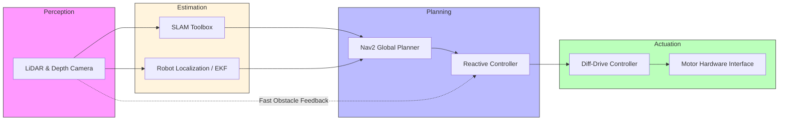

# Project Milestone 1: Proposal & Architecture

**Due:** Mar 6 | **Weight:** 5% | **Word Limit:** ~1,500 words (Approx. 3-4 pages)

Each Milestone consists of two parts: **Documentation** and **Technology**.

All project documentation must be submitted via a Markdown-based Jekyll website (hosted via GitHub Pages). The tutorial for this can be found [here](../tutorials/github_pages.md). 

This approach ensures that your technical documentation is as accessible and professional as the code residing in your git repository. By utilizing this format, you will learn how to build and maintain a static website, refine your technical writing skills, and showcase your work to a larger audience beyond the class.

---

## 1. Documentation

Milestone 1 serves as your technical project pitch. Your website should feature a clean, professional layout starting with the Mission Statement as the header, followed by your architectural visualization and module declarations.

### Required Sections

1. **Mission Statement & Scope:** Define the mission statement, scope, and the "success state" of your project. Identify the specific environment (e.g., cluttered warehouse, narrow hallway) and the primary problem your robot is designed to solve.
2. **Technical Specifications:**
* **Robot Platform:** Hardware (TurtleBot 4, etc.) or specific simulation environment.
* **Kinematic Model:** Declare the model (Differential Drive, Ackermann, or Holonomic).
* **Perception Stack:** List all sensors used (LiDAR, RGB-D, IMU).

3. **High-Level System Architecture:**
* **Mermaid Diagram:** Provide a visual flow following the Perception, Estimation, Planning and Actuation convention. This diagram must illustrate how data moves through various modules in the system.
* **Module Declaration Table:** A table listing every module in your diagram, explicitly labeled as either **Library** (existing ROS 2 packages) or **Custom** (code you will write). 
* **Module Intent**:
  * **Library:** Provide a 50-150 word writeup describing the intent behind choosing a specific package for module and the configuration you intend to tune (e.g. max velocity of the differential drive controller).
  * **Custom:** Provide a 100-200 word writeup describing the specific algorithm you intend to implement from scratch (e.g., "Implementing a custom RRT* to navigate narrow passages"). *Note: This abstract forms the "contract" for your Algorithmic Factor grade.*

4. **Safety & Operational Protocol:** Define the software **Deadman Switch** or any timeout logic to prevent hardware damage in the event of communication loss. Describe the specific conditions that trigger a system-wide "E-Stop."
5. **Git Infrastructure:** Link to your shared team repository and confirm the **Git Submodule** setup is active on your individual site.

> See [here](#4-example), for an example.

---

## 2. Technology

* **Repository Access:** The existence of a shared public git repository with teammates added as members.
* **Package Structure:** The repository should contain at least one **valid ROS 2 package** (containing a `package.xml`, `CMakeLists.txt` or `setup.py`, and source folders).
> **Note:** Do not upload the entire workspace directory. The repository should be the package itself or a collection of packages that a user can clone into their own workspace directory (ex: `colcon_ws/src/`).

* **README:** * A basic `README.md` mirroring the Mission Statement.

---

## 3. Grading  (100% Documentation)

### 3.1 Rubric

| Criteria | Weight | Expectation |
| --- | --- | --- |
| **Mission & Scope** | 30% | Clear definition of environment and success criteria. |
| **System Architecture** | 30% | High-quality Mermaid diagram and correct Library/Custom labels. |
| **Algorithmic Abstract** | 30% | Technical depth and feasibility of the proposed custom nodes. |
| **Safety & Protocol** | 10% | Rigor of the "Deadman Switch" logic and operational safety. |

### 3.2. Example Scenarios

*100% Documentation. Since this is a planning phase, the team typically receives a shared score.*

| Team Profile | Indiv. Factor | Mission (20%) | Arch (30%) | Abstract (30%) | Safety (20%) | **Total Points** |
| --- | --- | --- | --- | --- | --- | --- |
| **Excellent Pitch** | 1.0 | 20 | 30 | 30 | 20 | **5.0** |
| **Solid Effort** | 1.0 | 18 | 25 | 22 | 15 | **4.0** |
| **Minimal Detail** | 1.0 | 10 | 15 | 10 | 10 | **2.25** |

# 4. Example

Here is an example for a **Warehouse Search & Rescue Robot**. This robot is designed to navigate a cluttered environment to locate a specific marker while maintaining a high safety standard.

### 4.1. High-Level System Architecture

This diagram follows the **Perception → Estimation → Planning → Actuation** flow. It includes a "Reactive Bypass" where the Planning layer reads Perception data directly to ensure immediate obstacle avoidance, independent of the mapping speed.

---

#### 4.2 Module Declaration Table

| Module / Node | Functional Domain | Software Type | Description |
| --- | --- | --- | --- |
| **LiDAR/Camera Drivers** | Perception | **Library** | Ingests raw distance and image data from the hardware. |
| **SLAM Toolbox** | Estimation | **Library** | Generates the 2D occupancy grid for environmental mapping. |
| **Robot Localization** | Estimation | **Library** | Standard EKF to fuse wheel odometry and IMU data. |
| **Nav2 Global Planner** | Planning | **Library** | Calculates the long-distance path through the known map. |
| **Reactive Controller** | Planning | **Custom** | A custom implementation of the Dynamic Window Approach (DWA) to handle moving obstacles in real-time. |
| **Diff-Drive Controller** | Actuation | **Library** | Translates velocity commands into wheel rotations. |
| **Motor Hardware Interface** | Actuation | **Custom** | Low-level serial communication logic to interface with the motor encoders. |

---

### 4.3. Module Intent

#### Reactive Controller
This custom node will implement a **Vector Field Histogram (VFH)** algorithm from scratch. While the Global Planner (Library) provides the overall route, this custom node will ingest raw LiDAR data to detect unmapped obstacles (like pallets or moving workers). It will calculate a "polar histogram" of open space and adjust the robot's heading in real-time. This ensures the robot does not rely solely on the static map for safety, fulfilling the "Reactive Bypass" shown in the architecture.

#### EKF Localization
We will utilize the [robot_localization](https://github.com/cra-ros-pkg/robot_localization) package to implement an Extended Kalman Filter (EKF) for continuous state estimation. The primary intent is to provide a stable and fused odometry source by merging asynchronous data from the wheel encoders (high frequency, prone to slip) and the IMU (drift-prone, but accurate for orientation).

By tuning the per-sensor covariance matrices and the process noise covariance, we aim to mitigate the "dead reckoning" errors inherent in pure wheel odometry. Specifically, we will configure the EKF in a 2D pose estimation mode (x,y,θ) to provide a smooth `odom -> base_link` transform, ensuring that the Planning stack receives a reliable velocity and position estimate even during rapid accelerations or slight wheel slippage on the warehouse floor.
